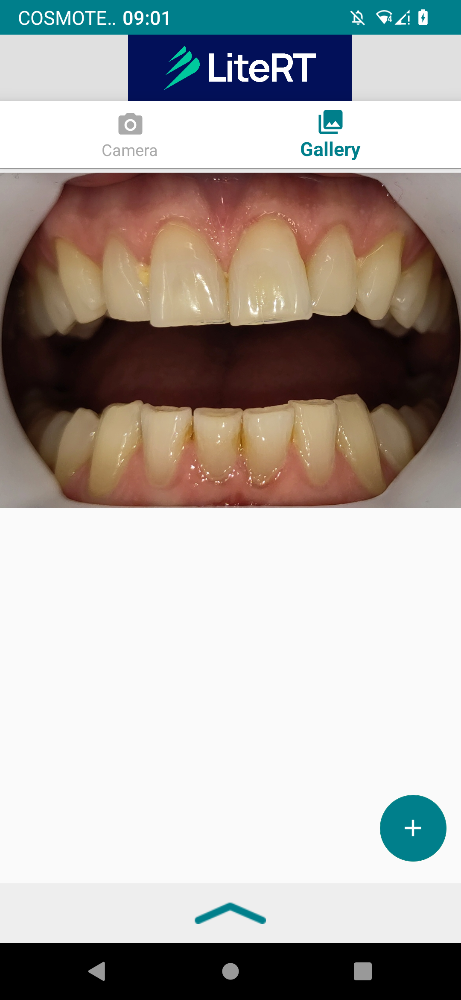
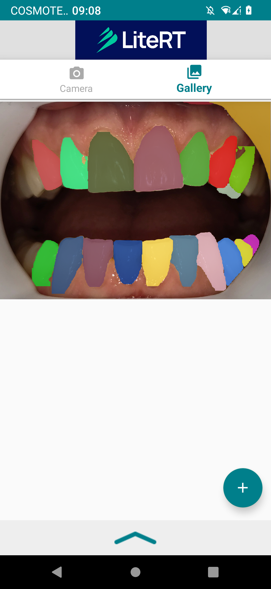

# FastSAM Image Segmentation Android Demo

# Overview

This is a camera app that continuously segment the objects in the frames seen
by your device's camera. **In this branch GPU is used if supported**.

# Model

[FastSAM by Ultralytics](https://docs.ultralytics.com/models/fast-sam/) is a real-time, CNN-based model designed to segment any object in an image with minimal computational resources. It builds on YOLOv8-seg and is tailored for high-speed and efficient segmentation across various tasks. 

**This project uses the FastSAM_s.pt variant**!

## Key Features
- Real-time segmentation using CNNs
- Efficient instance segmentation via prompt-guided selection (not applicable in this android demo)
- Built on YOLOv8-seg for fast and accurate performance

## Local Installation

```
git clone https://github.com/CASIA-IVA-Lab/FastSAM.git
cd FastSAM
pip install -r requirements.txt
```
## Or you can directly open the included repo notebook in colab:

<a target="_blank" href="https://colab.research.google.com/github/farmaker47/Fast_SAM_android/blob/master/FastSAM_tflite.ipynb">
  
</a>


# Build the Demo using Android Studio

## Prerequisites
- **Android Studio IDE**: Tested on Android Studio Dolphin.
- **Physical Android Device**: Minimum OS version SDK 24 (Android 7.0 - Nougat) with developer mode enabled.

## Building
1. Open Android Studio and select **Open an existing Android Studio project**.
2. Navigate to `./Fast_SAM-android` and click **OK**.
3. If prompted for Gradle Sync, click **OK**.
4. Connect your Android device, enable developer mode, and click the green **Run** arrow in Android Studio.

## Result after using an image from gallery

<p float="left">
  
  
</p>

## Medium post

[Implement LiteRT for a segmentation task utilizing the FastSAM model by Ultralytics.](https://farmaker47.medium.com/implement-litert-for-a-segmentation-task-utilizing-the-fastsam-model-by-ultralytics-9d7e14c88bd4)

## LiteRT

Google has rebranded TensorFlow Lite as LiteRT which is used inside this project. Despite the new name, LiteRT retains the same high-performance on-device AI runtime but with expanded vision for multi-framework support, including models built in TensorFlow, PyTorch, JAX, and Keras. This change aims to make deploying machine learning models easier and more efficient across Android, iOS, and embedded devices. The name reflects Google’s commitment to a lightweight, multi-framework AI future.

**Google Cloud credits are provided for this project** for the #AISprint September 2024.
